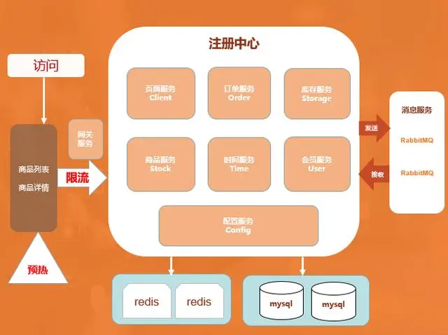
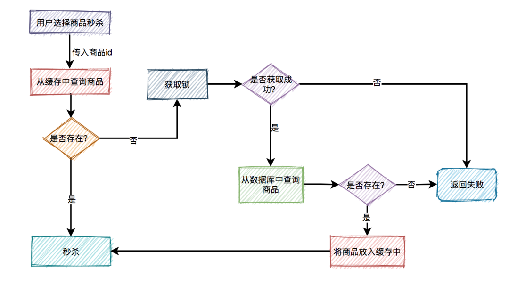

# 秒杀商城
----
Tasks
----
-[x]  服务注册 </br>
-[x]  编写基于watch机制的服务发现，并动态更新到kong网关 </br>
-[x]  使用grpc-gatewy同时提供grpc和http服务 </br>
-[x]  在common/register下编写自动发现可用IP和Port的函数FindAvailableEndpoint(numOfIp,numOfPort int)([]string,[]int,error)
-[x]  实现target的健康检查（主动和被动）
-[x]  定义通用服务启动接口，实现服务启动流程的统一规范
- [ ] 解决kong target不自动清除导致坏路由的bug
-[ ]  实现微服务配置中心（基于etcd）相关函数（配置监听、程序热更新、配置写入），并将此方法在
-[ ]  启用kong网关jwt认证插件/自定义jwt认证插件
-[ ]  编写grpc客户端装饰器，使用common模块中提供的负载均衡、限流、熔断等方法
-[ ]  秒杀核心方法 
-[ ]  编写一件启动部署脚本start_by_docker.sh

----
Problem
----
-[ ] internal/common/test的服务注册测试仅仅在127.0.0.1:12379下成功，替换成10.4.0.2:2379失败，Why？ </br>
----
Idea
----
-[ ] 通过将秒杀活动的kong routes中的Regex_priority 设置高一些提高秒杀体验
## 项目启动
   ### A. 通过Docker部署
Mac\linux 下通过执行
```bash
sh ./start_by_docker.sh
```
   ### B. 通过K8s部署
```bash

```

## 目录结构

MSproject
├── README.md # 项目的说明文件，包含项目简介、安装说明、使用文档等
├── api # 存放与外部接口相关的文件
│ └── googleapis # 存放 Google API 的相关配置或接口代码
├── docker # 存放与 Docker 配置和容器相关的文件
├── etcd-cluster # 存放与 Etcd 集群相关的文件
│ ├── data # Etcd 数据存储目录
│ ├── docker-compose.yml # Etcd 集群的 Docker Compose 配置文件，用于启动容器
│ └── main.go # Etcd 集群相关的 Go 程序入口文件
├── gateway-kong # 存放 Kong API 网关相关的文件
│ ├── config # Kong 网关的配置文件目录
│ ├── data # Kong 网关的数据存储目录
│ └── docker-compose.yml # 启动 Kong 网关的 Docker Compose 配置文件
├── go.work # Go 工作空间配置文件，用于 Go Modules 的管理
├── go.work.sum # Go Modules 校验和文件
├── images # 存放项目中使用的图片文件
│ ├── huancunjichuan.png # 图片文件 1
│ └── img.png # 图片文件 2
├── scripts # 存放各种自动化脚本
├── src # 存放源代码文件的根目录
│ ├── common # 公共模块或工具类代码
│ ├── order-service # 订单服务模块代码
│ ├── page-service # 页面服务模块代码
│ ├── product-service # 产品服务模块代码
│ ├── stock-service # 库存服务模块代码
│ ├── test-service # 测试服务模块代码
│ └── user-service # 用户服务模块代码
├── start_by_docker.sh # 启动项目的 Docker 脚本文件
└── test # 存放测试相关的文件
   
## 技术栈一览
 - etcd 服务注册和发现
 - kong 负载均衡和流量管理
 - grpc 通讯协议和rpc调用
 - redis 缓存信息
 - mysql / mongodb 数据库存储
 - rabbitmq 消息队列-削峰、解耦
 - docker 容器化技术
 - 下一版本技术
   - GitLab-CICD
   - K8s 弹性扩展滚动更新高可用
   - elasticsearch + kibana 搜索引擎+可视化
   - 监控和日志系统
## 技术架构图


## 功能实现
前端技术 (单独的项目)
  - uniapp （商城app实现）
后端主要实现以下几个微服务模块：
  - 用户信息模块
  - 订单模块
  - 商品信息模块
  - 库存服务模块
  - 页面基础服务模块

## 系统优化策略
### 微服务调用链导致的缓存雪崩 —— 熔断机制


### 页面静态化
秒杀商品页面的信息尽量写死，防止多余请求。\
HTML页面上生成倒计时的时钟，直到 秒杀开始 的时候，页面自动刷新，于此同时后台程序在CDN节点上面 更新了JS文件的内容。\
此时 加载到最新的js文件，于是js文件生成 秒杀按钮，用户点击按钮之后，js就会向后台程序发出秒杀请求。
### CDN 前端资源优化

### 预扣库存
先扣除了库存，保证不超卖，然后异步生成用户订单 \
用户拿到了订单，不支付怎么办？我们都知道现在订单都有有效期，比如说用户五分钟内不支付，订单就失效了，订单一旦失效，就会加入新的库存，这也是现在很多网上零售企业保证商品不少卖采用的方案。
### 消息队列解耦
订单的生成是异步的,一般都会放到MQ这样的即时消费队列中处理,订单量比较少的情况下，生成订单非常快，用户几乎不用排队。

### redis缓存——本地扣库存
把一定的库存量分配到本地机器，直接在内存中减库存，然后按照之前的逻辑异步创建订单
本地缓存->redis分布式缓存->数据库

### 缓存击穿问题：分布式锁

未命中时先拿锁再访问数据库
### 缓存穿透问题：
布隆过滤器/缓存空对象/提前过滤非法查询商品id 
### 缓存雪崩问题：
设置随机TTL和使用redis集群方案